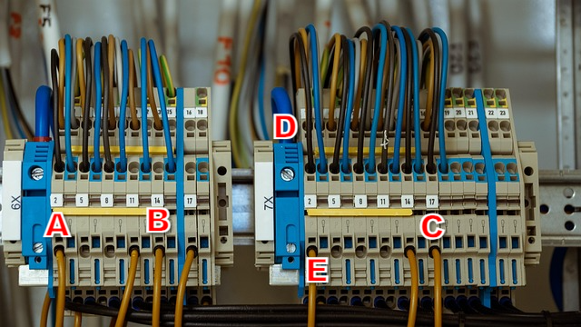

# image_labeling_tool

웹 브라우저에서 이미지를 불러온 뒤 클릭 위치마다 A, B, C 순서로 알파벳 라벨을 붙이는 간단한 이미지 라벨링 도구입니다. 별도 서버 없이 `image_labeling_tool.html` 파일만 열어 사용할 수 있는 정적 HTML 도구입니다.

## 파일 구성

| 파일 | 설명 |
|---|---|
| `image_labeling_tool.html` | 업로드, 캔버스 표시, 라벨 추가/선택/삭제/저장 기능을 포함한 웹 도구 |
| `labeled-image.png` | README에서 보여주는 실행 예시 이미지 |
| `README.md` | 도구 설명 문서 |

## 주요 기능

1. 이미지 업로드
   - 로컬 JPG/PNG 이미지를 선택해 캔버스에 표시합니다.
   - 이미지 비율을 유지하면서 화면에 맞게 조정합니다.

2. 알파벳 라벨 추가
   - 이미지 위를 클릭하면 A부터 Z까지 순서대로 라벨이 추가됩니다.
   - 라벨은 굵은 글자, 테두리, 그림자 스타일로 표시되어 배경과 구분됩니다.

3. 라벨 선택과 삭제
   - 이미 추가한 라벨을 클릭하거나 드래그해 선택할 수 있습니다.
   - `Delete` 또는 `Backspace` 키로 선택된 라벨을 삭제합니다.
   - 삭제 후 다음 라벨 순서가 자동으로 갱신됩니다.

4. 결과 저장
   - 라벨이 포함된 캔버스 결과를 이미지 파일로 저장할 수 있습니다.
   - 보고서나 데이터 정리용 주석 이미지 제작에 적합합니다.

## 사용 방법

1. `image_labeling_tool.html`을 브라우저에서 엽니다.
2. 이미지 파일을 업로드합니다.
3. 라벨을 붙이고 싶은 위치를 순서대로 클릭합니다.
4. 필요하면 라벨을 선택해 삭제하거나 다시 추가합니다.
5. 저장 버튼으로 라벨링된 이미지를 내보냅니다.

## 활용 예시

- 실험 이미지의 관심 지점 표시
- 보고서용 이미지 주석 작성
- 객체 위치를 알파벳으로 구분하는 간단한 라벨링 작업

## 작성자 정보

| 항목 | 내용 |
|---|---|
| 작성자 | arraybox |
| 이름 | 이일주 |
| 이메일 | arraybox@chungbuk.ac.kr |
| 학번 | 2025254015 |

